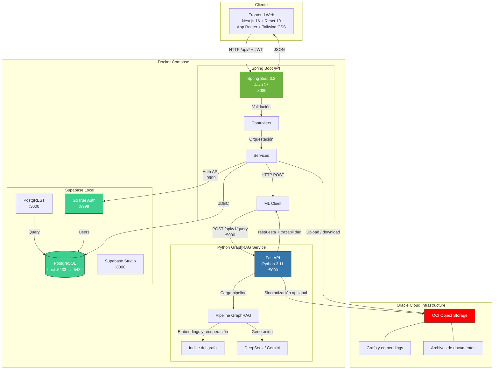

# TechISOlutions — Documentación ISO 45001 clasificada y trazable

**Hackathon ONE – Proyectos G9 | Alura + Oracle | G9-LATAM-Team_40**

Repositorio de políticas, matrices y registros de Seguridad y Salud en el Trabajo (SST). Clasifica documentos según categorías normativas ISO 45001, extrae palabras clave y responde consultas sobre el corpus con un pipeline GraphRAG y trazabilidad a las secciones fuente.

Los artefactos internos (paquetes Java, contenedores Docker, base de datos) siguen el identificador técnico `techcontent`. El producto se llama **TechISOlutions**.

---

## Tabla de Contenidos

- [Descripción](#descripción)
- [Arquitectura](#arquitectura)
- [Frontend](docs/frontend-arquitectura.md)
- [Tecnologías](#tecnologías)
- [Despliegue](#despliegue)
- [API Endpoints](#api-endpoints)
- [Requisitos](#requisitos)
- [Instalación y Ejecución](#instalación-y-ejecución)
- [Equipo](#equipo)

---

## Descripción

**TechISOlutions** recibe texto o archivos (PDF, TXT, MD) de documentación SST y:

- Asigna una **categoría normativa** (Política SST, Procedimientos, Matrices de Riesgo, Registros, Auditorías).
- Extrae **palabras clave** para búsqueda.
- Genera una **respuesta GraphRAG** con trazabilidad hacia las secciones recuperadas del grafo de conocimiento.
- Guarda archivos en **OCI Object Storage** y metadatos en PostgreSQL.
- Expone un **grafo de relaciones** en la API (`/api/grafos`) y una vista de grafo en el frontend.

La interfaz web está en `frontend/techisolutions/` (Next.js) y consume exclusivamente el backend Spring Boot. El landing muestra una demo estática; las rutas autenticadas no tienen modo mock.

---

## Arquitectura



### Componentes

| Componente | Tecnología | Puerto | Descripción |
|---|---|---|---|
| **Frontend Web** | Next.js 16 + React 19 + TypeScript | host `${FRONTEND_PORT:-3001}` → `:3000` | App Router, Tailwind CSS 4, shadcn/ui. Compose en 3001; `bun run dev` en 3000. |
| **API principal** | Java 17 + Spring Boot 3.2.12 | `:8080` | Auth, consultas, archivos, índices, categorías y grafos. |
| **Motor GraphRAG** | Python 3.11 + FastAPI | red interna `:5000` | Recupera corpus base + overlay privado y genera trazabilidad. |
| **Base de datos** | PostgreSQL (Supabase) | host `:5433` → `:5432` | Persistencia de consultas, archivos, grafos y usuarios. |
| **Autenticación** | GoTrue (Supabase Auth) | `:9999` | Registro, login y JWT. |
| **REST auto** | PostgREST | `:3000` | API REST generada desde PostgreSQL. |
| **OCI Object Storage** | Bucket S3-compatible | — | Grafos, embeddings y documentos. |

### Flujos

**Consulta GraphRAG (`POST /api/consultas`):**

```
1. Cliente → { pregunta } + Bearer JWT
2. Spring obtiene el user_id desde el JWT y envía pregunta + UUID al ML interno.
3. FastAPI recupera siempre BASE y solo el release PRIVADO de ese UUID.
4. Spring persiste pregunta, respuesta, relevancia, tiempo y trazabilidad completa.
5. Cliente recibe fuentes con corpus BASE/PRIVADO; nunca source_path ni URLs OCI.
```

**Archivos privados (`POST /api/archivos`):**

```
1. Cliente → multipart `file` + `dominio` (`ISOS` o `LEYES`) + Bearer JWT.
2. Spring valida nombre, extensión, MIME y tamaño (PDF/TXT/MD, máximo 10 MB).
3. El objeto se guarda bajo `${OCI_PREFIX}/users/<uuid>/input/<dominio>/` (`OCI_PREFIX=prod` por defecto) y la API devuelve solo metadata.
4. El índice privado se reconstruye en segundo plano con generaciones coalescidas.
5. Las descargas pasan por `GET /api/archivos/{id}/descarga`; el navegador nunca recibe una URL OCI.
6. DELETE marca el archivo como pendiente; el job siguiente elimina el objeto y la fila cuando publica el release.
```

**Índice privado:**

```
1. Una carga o eliminación incrementa la generación solicitada del usuario.
2. El backend envía un snapshot de documentos al servicio GraphRAG mediante un job idempotente.
3. El estado se consulta en GET /api/indice y se puede reintentar con POST /api/indice/reintentar.
4. El release publicado queda asociado al usuario y se expone en GET /api/grafos/privado.
```

**Grafo:**

```
GET /api/grafos/actual          → último snapshot BASE persistido
GET /api/grafos/privado         → último release PRIVADO del usuario autenticado
```

Object Storage permanece inaccesible desde el navegador.

---

## Tecnologías

### Backend
- Java 17 / Spring Boot 3.2.12
- Spring Web, Security, Data JPA, Validation, Actuator
- JWT (HS256 con `SUPABASE_JWT_SECRET` y ES256 vía JWKS)
- Lombok, Maven, JUnit 5 + Mockito
- Paquete: `com.techcontent.ai`

### Frontend
- Next.js 16 (App Router), React 19, TypeScript 5
- Tailwind CSS 4, shadcn/ui, lucide-react, next-themes
- Bun (`bun.lock`)
- Ubicación: `frontend/techisolutions/`

### Ciencia de datos (servicio en `:5000`)
- Python 3.11, FastAPI, Uvicorn
- Pipeline GraphRAG: sentence-transformers (`paraphrase-multilingual-mpnet-base-v2`), spaCy, NetworkX
- LLMs: DeepSeek y Gemini
- Artefactos en `datascience/db` u OCI (`DATA_SOURCE=oci`)

### Infraestructura
- Docker Compose (VPS Linux)
- Supabase local: PostgreSQL + GoTrue + PostgREST + Studio
- OCI Object Storage

---

## Despliegue

La infraestructura de aplicación corre en **VPS (Linux)** con Docker Compose. **OCI Object Storage** guarda grafos, embeddings y archivos de usuarios.

No hay pipeline de GitHub Actions en el repositorio. La configuración se toma del `.env` de la raíz; `.env.example` documenta nombres y valores de referencia.

`ML_INTERNAL_TOKEN` es obligatorio y debe tener el mismo valor en `backend` y `ml-service`. Compose monta `OCI_CLI_KEY_FILE` como secreto de solo lectura y exige que la ruta exista en el host. Con `DATA_SOURCE=oci`, el servicio GraphRAG necesita además `OCI_DATASET_BUCKET`, `OCI_NAMESPACE` y las credenciales OCI.

Ejemplo mínimo de variables OCI:

```bash
OCI_CLI_USER=ocid1.user.oc1...
OCI_CLI_TENANCY=ocid1.tenancy.oc1...
OCI_CLI_REGION=sa-santiago-1
OCI_DATASET_BUCKET=your-graphrag-dataset-bucket
OCI_NAMESPACE=your-oci-namespace
OCI_PREFIX=prod
```

---

## API Endpoints

Base: `http://localhost:8080`. Salvo auth y actuator, todos requieren `Authorization: Bearer <jwt>`. Los identificadores de archivos, consultas y grafos son UUID cuando la respuesta los incluye.

Colección Postman: [`docs/TechISOlutions.postman_collection.json`](docs/TechISOlutions.postman_collection.json).

### Auth (público)

#### `POST /auth/register` · `POST /auth/login`

```json
{ "email": "sst@example.com", "password": "password123" }
```

```json
{
  "access_token": "eyJ...",
  "refresh_token": "...",
  "token_type": "bearer",
  "expires_in": 3600
}
```

El `access_token` se envía como Bearer en los endpoints protegidos. El rol `ADMIN` del JWT es necesario para sincronizar el grafo base.

### Consultas GraphRAG

#### `POST /api/consultas`

Analiza una pregunta y persiste el resultado para el usuario autenticado. `pregunta` es obligatorio y debe tener al menos 20 caracteres.

```json
{
  "pregunta": "¿Qué obligaciones de seguridad contiene el corpus normativo?"
}
```

La respuesta incluye `id`, `pregunta`, `respuesta`, `categoria_fuente_principal`, `relevancia`, `palabras_clave`, `trazabilidad`, `tiempo_segundos` y `procesado_en`. Cada elemento de `trazabilidad` incluye `documento_id`, `documento_titulo`, `categoria`, `palabras_clave`, `titulo_seccion`, `ruta_jerarquica`, `nivel`, `dominio`, `relevancia`, `corpus` (`BASE` o `PRIVADO`) y `archivo_id` nullable.

```json
{
  "id": "7f1d5b22-2f1e-4a73-9af4-7df0b2b4f1e5",
  "pregunta": "¿Qué obligaciones de seguridad contiene el corpus normativo?",
  "respuesta": "Respuesta generada con evidencia...",
  "categoria_fuente_principal": "Seguridad",
  "relevancia": 0.92,
  "palabras_clave": ["seguridad", "obligaciones"],
  "trazabilidad": [
    {
      "documento_id": "doc-001",
      "documento_titulo": "Manual SST",
      "titulo_seccion": "Obligaciones",
      "ruta_jerarquica": ["Capítulo 1"],
      "nivel": 1,
      "dominio": "ISOS",
      "relevancia": 0.92,
      "corpus": "BASE",
      "archivo_id": null
    }
  ],
  "tiempo_segundos": 1.1,
  "procesado_en": "2026-08-24T12:00:00"
}
```

| Método | Ruta | Descripción |
|---|---|---|
| POST | `/api/consultas` | Analizar y persistir una pregunta |
| GET | `/api/consultas` | Historial de consultas del usuario |
| GET | `/api/consultas/buscar?q=` | Buscar consultas del usuario por keywords |

### Archivos privados

`POST /api/archivos` usa `multipart/form-data` con `file` y `dominio` obligatorios. `dominio` acepta `ISOS` o `LEYES`; se admiten PDF, TXT y Markdown de hasta 10 MB.

`GET /api/archivos` devuelve `{ "items": [], "page", "size", "totalElements", "totalPages" }`. Admite `page` (por defecto `0`), `size` (por defecto `20`, máximo `100`), `q` (máximo 100 caracteres) y `tipo` (`pdf`, `txt` o `md`).

| Método | Ruta | Descripción |
|---|---|---|
| POST | `/api/archivos` | Subir un archivo privado y marcar el índice como pendiente |
| GET | `/api/archivos` | Listar archivos privados paginados |
| GET | `/api/archivos/{id}` | Obtener metadata del archivo; nunca expone URL OCI |
| GET | `/api/archivos/{id}/descarga` | Descargar el binario mediante streaming autenticado |
| DELETE | `/api/archivos/{id}` | Marcar para eliminación; devuelve `202 Accepted` |

La respuesta de archivo incluye `id`, `nombre`, `documento_id`, `dominio`, `tamano`, `tipo`, `subido_en`, `indexado_en` y `pendiente_eliminacion`. El archivo se elimina físicamente de OCI y PostgreSQL al finalizar correctamente la reconstrucción correspondiente.

### Índice privado

El índice se actualiza de forma asíncrona. `GET /api/indice` devuelve `estado`, `etapa`, `mensaje`, `release_id`, `generation`, `rebuild_pendiente` y `actualizado_en`.

| Estado | Significado |
|---|---|
| `IDLE` | Sin cambios pendientes |
| `DIRTY` | Hay cambios que requieren una reconstrucción |
| `QUEUED` | Job enviado al servicio GraphRAG |
| `RUNNING` | Job en ejecución |
| `SUCCEEDED` | Release publicado |
| `FAILED` | Falló la reconstrucción; se puede usar retry |

| Método | Ruta | Descripción |
|---|---|---|
| GET | `/api/indice` | Consultar el estado persistido del índice del usuario |
| POST | `/api/indice/reintentar` | Solicitar una nueva reconstrucción; devuelve `202 Accepted` |

### Categorías

`GET /api/categorias` devuelve una lista con `{ "nombre", "total_consultas" }` para el usuario autenticado.

### Grafos

| Método | Ruta | Descripción |
|---|---|---|
| GET | `/api/grafos/privado` | Último release privado del usuario autenticado |
| POST | `/api/grafos/sincronizar` | Sincronizar el snapshot BASE desde OCI; requiere `ROLE_ADMIN`, devuelve `201 Created` |
| GET | `/api/grafos/actual` | Último snapshot BASE persistido |
| GET | `/api/grafos/historial` | Historial BASE paginado (`page`, `size`) |
| GET | `/api/grafos/buscarfecha?desde=&hasta=` | Snapshots BASE dentro del rango ISO `yyyy-MM-dd` |
| GET | `/api/grafos/id/{id}` | Snapshot BASE por UUID |

`POST /api/grafos/sincronizar` acepta `objectName` opcional. Las respuestas incluyen `json_data`, `fecha_creacion`, `scope` (`BASE` o `PRIVATE`), `release_id` y `generation`; los releases privados no se duplican en PostgreSQL.

### Health

`GET /actuator/health` → `{ "status": "UP" }` (público). `GET /actuator/info` también es público.

Los errores usan `{ "error": "...", "mensaje": "..." }`. Según el caso se devuelven `400` (validación), `401`/`403` (auth), `404` (recurso), `503` (servicio externo) o `500` (error interno).

---

## Requisitos

- Java 17+ y Maven 3.8+
- Node.js 20.9+ y Bun 1.x
- Python 3.11+, pip 23+, Git LFS (artefactos en `datascience/db`)
- Docker 24+ y Docker Compose v2
- Cuenta OCI con Object Storage (archivos y, si `DATA_SOURCE=oci`, el grafo)

---

## Instalación y Ejecución

### 1. Clonar el repositorio

```bash
git clone git@github.com:No-Country-simulation/G9-LATAM-Team_40.git
cd G9-LATAM-Team_40
git lfs pull
```

### 2. Configurar variables de entorno

```bash
cp .env.example .env
```

Completar al menos: `ML_INTERNAL_TOKEN` (el mismo valor para `backend` y `ml-service`), `DEEPSEEK_API_KEY` (obligatoria para arrancar la API GraphRAG; `GEMINI_API_KEY` puede usarse en tareas auxiliares), credenciales OCI (`OCI_CLI_*`, bucket, namespace y ruta de clave), y claves de Supabase. Todas las ejecuciones parten del `.env` de la raíz; el archivo no se carga automáticamente en procesos del host.

Para desarrollo local, exportar las variables antes de usar Maven, Uvicorn o Bun:

```bash
set -a
. ./.env
set +a
```

### 3. Ejecutar con Docker Compose

```bash
docker compose up -d
# equivalente: make up
```

- GraphRAG exige `DEEPSEEK_API_KEY` (si falta: `docker compose logs ml-service` → `Missing credentials`).
- `git lfs pull` antes de levantar el stack si los artefactos van en local.

| Servicio | URL |
|---|---|
| Frontend Next.js | http://localhost:3001 |
| Spring Boot API | http://localhost:8080 |
| ML GraphRAG | red interna `ml-service:5000` (sin publicación host) |
| PostgreSQL (host) | localhost:5433 |
| Supabase Auth | http://localhost:9999 |
| PostgREST | http://localhost:3000 |
| Supabase Studio | http://localhost:8000 |

### 4. Ejecutar sin Docker (desarrollo local)

Infraestructura (DB + Auth) en Docker, apps en el host. Ejecutar cada proceso en una terminal separada:

```bash
make infra          # Postgres :5433, GoTrue :9999, PostgREST :3000, Studio :8000
make local-ml       # FastAPI :5000
make local-backend  # Spring Boot :8080
```

`make local-frontend` usa el puerto `3000`; con `make infra`, PostgREST ya ocupa ese puerto. En ese caso iniciar el frontend manualmente en `3002` como se muestra abajo.

O a mano, después de exportar `.env`:

```bash
# ML
(
  cd datascience/proyecto
  pip install -r requirements.txt
  PYTHONPATH=src uvicorn src.api.app:app --host 0.0.0.0 --port 5000 --reload
)

# Backend
(
  cd backend
  ./mvnw spring-boot:run
)

# Frontend
(
  cd frontend/techisolutions
  bun install
  bun run dev -- --port 3002
)
```

Con infra en Docker, `SPRING_DATASOURCE_URL` debe apuntar a `jdbc:postgresql://localhost:5433/techcontent` y `NEXT_PUBLIC_API_URL` a `http://localhost:8080`.


### 5. Probar la API

```bash
# Registro
curl -X POST http://localhost:8080/auth/register \
  -H "Content-Type: application/json" \
  -d '{"email":"sst@example.com","password":"password123"}'

# Login
curl -X POST http://localhost:8080/auth/login \
  -H "Content-Type: application/json" \
  -d '{"email":"sst@example.com","password":"password123"}'

# Consulta GraphRAG (sustituir <token>)
curl -X POST http://localhost:8080/api/consultas \
  -H "Content-Type: application/json" \
  -H "Authorization: Bearer <token>" \
  -d '{"pregunta":"¿Qué obligaciones de seguridad contiene el corpus normativo?"}'
```

---

## Equipo

**G9-LATAM-Team_40** — Hackathon ONE | Alura + Oracle

| Rol | Stack |
|---|---|
| Data Science | Python 3.11, FastAPI, GraphRAG, embeddings, spaCy |
| Backend | Java 17, Spring Boot 3.2, Maven, Supabase, OCI |
| Infraestructura / DevOps | OCI, Docker Compose, Supabase local |
| Frontend | Next.js 16, React 19, TypeScript, Tailwind CSS 4, shadcn/ui |

---

## Licencia

Este proyecto es desarrollado para el Hackathon ONE – Proyectos G9 de Alura Latam + Oracle.
