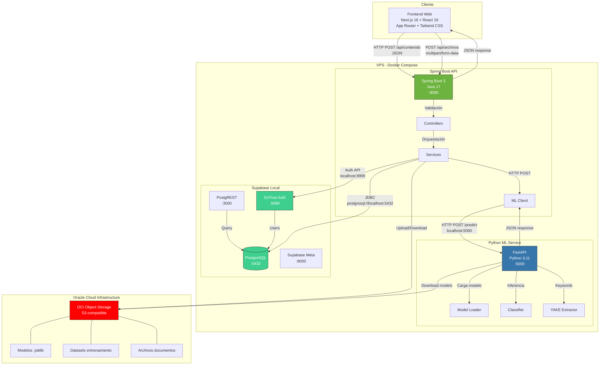

# ISContent AI — Organización Inteligente de Contenido Técnico

**Hackathon ONE – Proyectos G9 | Alura + Oracle**

Solución para la organización inteligente de contenido técnico mediante técnicas de Ciencia de Datos, expuesta a través de una API REST en Java/Spring Boot con integración a OCI Object Storage y Supabase para persistencia y autenticación.

---

## Tabla de Contenidos

- [Descripción](#descripción)
- [Arquitectura](#arquitectura)
- [Tecnologías](#tecnologías)
- [CI/CD y Despliegue](#ci-y-despliegue)
- [API Endpoints](#api-endpoints)
- [Requisitos](#requisitos)
- [Instalación y Ejecución](#instalación-y-ejecución)
- [Equipo](#equipo)

---

## Descripción

**TechContent AI** permite organizar, clasificar y enriquecer contenido técnico de forma automática. Recibe textos técnicos (documentación, tutoriales, anotaciones de estudio, artículos) y utiliza modelos de Machine Learning para:

- **Clasificación temática** del contenido (Backend, Frontend, DevOps, Data Science, etc.)
- **Extracción de palabras clave** relevantes
- **Agrupación por temas similares** y **recomendación de contenidos relacionados**

El resultado se expone en formato JSON para su consumo por otras aplicaciones, plataformas educativas o equipos técnicos que deseen construir repositorios inteligentes de conocimiento.

La plataforma incluye un frontend web construido con **Next.js** que consume la API y expone la clasificación de contenido al usuario final.

---

## Arquitectura



### Componentes

| Componente | Tecnología | Puerto | Descripción |
|---|---|---|---|
| **Frontend Web** | Next.js 16 + React 19 + TypeScript | host `${FRONTEND_PORT:-3001}` → `:3000` | Aplicación web (App Router, Tailwind CSS 4, shadcn/ui). Corre en Docker Compose (puerto 3001) o en dev local (puerto 3000). |
| **API Principal** | Java 17 + Spring Boot 3 | `:8080` | Recibe peticiones REST, valida entrada, orquesta el procesamiento y devuelve resultados JSON. |
| **Motor ML** | Python 3.11 + FastAPI | `:5000` | Servicio interno que carga el modelo serializado y ejecuta inferencia (clasificación, keywords, similitud). |
| **Base de Datos** | PostgreSQL (Supabase) | `:5432` | Persistencia de resultados, metadatos de contenido procesado y usuarios. |
| **Autenticación** | GoTrue (Supabase Auth) | `:9999` | Gestión de usuarios, JWT tokens, registro y login. |
| **REST API Auto** | PostgREST | `:3000` | API REST generada automáticamente desde el esquema de PostgreSQL. |
| **OCI Object Storage** | Bucket S3-compatible | - | Almacenamiento de modelos serializados (`.joblib`), datasets de entrenamiento y documentos/archivos de usuarios. |

### Flujo de Procesamiento

**Clasificación de texto:**
```
1. Cliente → POST /api/contenido  (JSON con título y texto + JWT token)
2. Spring Boot valida JWT con Supabase Auth
3. Spring Boot valida la entrada
4. Spring Boot → POST http://localhost:5000/predict  (texto preprocesado)
5. FastAPI carga modelo desde Object Storage y ejecuta:
   - TF-IDF + vectorización del texto
   - Clasificación con Regresión Logística / Random Forest
   - Extracción de keywords con YAKE / TF-IDF scores
6. FastAPI → JSON con categoría, keywords, scores  →  Spring Boot
7. Spring Boot persiste resultado en Supabase PostgreSQL
8. Spring Boot enriquece respuesta y la retorna al cliente
```

**Almacenamiento de archivos:**
```
1. Cliente → POST /api/archivos  (multipart/form-data + JWT token)
2. Spring Boot valida JWT y tipo de archivo
3. Spring Boot sube archivo a OCI Object Storage
4. Spring Boot guarda metadata (URL, tamaño, tipo) en Supabase PostgreSQL
5. Spring Boot retorna URL de acceso al cliente
```

---

## Tecnologías

### Backend
- **Java 17** / **Spring Boot 3.2**
- **Spring Web** (REST API)
- **Spring Boot Actuator** (health checks, métricas)
- **Spring Validation** (validación de entrada)
- **Spring Security** (integración con Supabase Auth)
- **Lombok** (reducción de boilerplate)
- **Maven** (gestión de dependencias y build)
- **JUnit 5 + Mockito** (pruebas)

### Frontend
- **Next.js 16** (App Router) — SSR/SSG y routing por convención
- **React 19** + **TypeScript 5**
- **Tailwind CSS 4** — estilizado utilitario
- **shadcn/ui** (Base UI) — componentes accesibles
- **lucide-react** — iconografía · **next-themes** — dark/light mode
- **Bun** — package manager (`bun.lock`)
- Ubicación: `frontend/techisolutions/`

### Ciencia de Datos
- **Python 3.11**
- **Pandas** — manipulación de datos
- **Scikit-learn** — TF-IDF, Regresión Logística, métricas
- **NLTK / spaCy** — procesamiento de lenguaje natural (tokenización, stopwords, lematización)
- **YAKE** — extracción de palabras clave
- **Joblib** — serialización del modelo

### Infraestructura
- **Supabase Local** (Docker) — PostgreSQL + Auth + PostgREST
- **Oracle Cloud Infrastructure (OCI)** — Object Storage
- **Docker / Docker Compose** — containerización
- **Nginx** (opcional) — reverse proxy

---

## CI/CD y Despliegue

### Integración OCI

El proyecto utiliza **OCI Object Storage** como servicio obligatorio de Oracle Cloud:

| Servicio | Uso |
|---|---|
| **OCI Object Storage** | Bucket para almacenar modelos serializados (`.joblib`), datasets de entrenamiento y documentos/archivos de usuarios. |

El resto de la infraestructura corre en **VPS (Linux)** con Docker Compose.

### Pipeline CI/CD (GitHub Actions)

```
push → Run Tests (JUnit + Pytest) → Build Docker images →
  → Deploy to VPS via SSH
```

### Variables de Entorno OCI

```bash
OCI_CLI_USER=ocid1.user.oc1...
OCI_CLI_TENANCY=ocid1.tenancy.oc1...
OCI_CLI_REGION=sa-santiago-1
OCI_MODEL_BUCKET=techcontent-models
OCI_DATASET_BUCKET=techcontent-datasets
OCI_FILES_BUCKET=techcontent-files
```

---

## API Endpoints

### `POST /api/contenido`

Clasifica un texto técnico y extrae palabras clave.

**Headers:**
```
Authorization: Bearer <supabase-jwt-token>
Content-Type: application/json
```

**Request Body:**
```json
{
  "titulo": "Introducción a Spring Boot",
  "texto": "En este contenido se presentan los conceptos básicos para la creación de APIs REST utilizando Java y Spring Boot. Se abordan temas como controladores, servicios, inyección de dependencias y configuración de proyectos."
}
```

**Response (200 OK):**
```json
{
  "id": "a1b2c3d4",
  "categoria": "Backend",
  "probabilidad": 0.89,
  "palabras_clave": ["Java", "Spring Boot", "API REST", "Inyección de dependencias"],
  "contenidos_relacionados": [
    {
      "id": "e5f6g7h8",
      "titulo": "Spring Boot Avanzado: Seguridad con JWT",
      "similitud": 0.76
    }
  ],
  "procesado_en": "2026-07-23T14:30:00Z"
}
```

### `POST /api/archivos`

Sube un archivo a OCI Object Storage y guarda su metadata.

**Headers:**
```
Authorization: Bearer <supabase-jwt-token>
Content-Type: multipart/form-data
```

**Request Body:**
```
file: <archivo>
```

**Response (200 OK):**
```json
{
  "id": "f1g2h3i4",
  "nombre": "documentacion-spring.pdf",
  "url": "https://objectstorage.sa-saopaulo-1.oraclecloud.com/n/.../documentacion-spring.pdf",
  "tamano": 1048576,
  "tipo": "application/pdf",
  "subido_en": "2026-07-23T14:30:00Z"
}
```

### `GET /api/archivos`

Lista todos los archivos del usuario autenticado.

### `GET /api/archivos/{id}`

Obtiene la URL de descarga de un archivo específico.

### `POST /api/contenido/lote`

Procesa múltiples documentos en una sola petición.

### `GET /api/contenido/buscar?q=spring+boot`

Búsqueda semántica por palabras clave entre contenidos previamente procesados.

### `GET /api/categorias`

Lista todas las categorías disponibles con la cantidad de documentos por categoría.

### `POST /auth/register`

Registro de nuevos usuarios (delegado a Supabase Auth).

### `POST /auth/login`

Inicio de sesión y obtención de JWT token (delegado a Supabase Auth).

### `GET /actuator/health`

Health check del servicio.

---

## Requisitos

### Backend (Java)
- Java 17+
- Maven 3.8+
- Spring Boot 3.2

### Frontend (Next.js)
- Node.js 20.9+ (requerido por Next.js 16)
- Bun 1.x (package manager; `bun.lock` en el repo)
- Proyecto: `frontend/techisolutions/`

### ML Service (Python)
- Python 3.11+
- pip 23+
- FastAPI + Uvicorn

### Infraestructura
- Docker 24+ y Docker Compose v2
- VPS Linux (Ubuntu 22.04 recomendado)
- Cuenta OCI con acceso a Object Storage
- OCI CLI configurado (para acceso a buckets)

---

## Instalación y Ejecución

### 1. Clonar el repositorio
```bash
git clone git@github.com:No-Country-simulation/G9-LATAM-Team_40.git
cd G9-LATAM-Team_40
```

### 2. Configurar variables de entorno
```bash
cp .env.example .env
# Editar .env con credenciales OCI y configuraciones de Supabase
```

### 3. Ejecutar con Docker Compose
```bash
docker compose up -d
```

Esto levanta:
- **Frontend Next.js** en `http://localhost:3001`
- **Spring Boot API** en `http://localhost:8080`
- **ML Service Python** en `http://localhost:5000`
- **Supabase PostgreSQL** en `http://localhost:5432`
- **Supabase Auth** en `http://localhost:9999`
- **Supabase REST** en `http://localhost:3000`

### 4. Ejecutar sin Docker (desarrollo local)

**ML Service:**
```bash
cd ml-service
pip install -r requirements.txt
uvicorn app.main:app --host 0.0.0.0 --port 5000 --reload
```

**Backend:**
```bash
cd backend
./mvnw spring-boot:run
```

**Frontend (Next.js):**
```bash
cd frontend/techisolutions
bun install
bun run dev
```

> **Nota:** el dev server de Next.js usa el puerto `3000` por defecto. Si el stack de Docker está levantado, PostgREST ocupa el `3000` y el frontend de Compose el `3001` — usa `bun run dev -- --port 3002`.

### 6. Probar la API
```bash
# Registrar usuario
curl -X POST http://localhost:9999/auth/v1/signup \
  -H "Content-Type: application/json" \
  -H "apikey: <anon-key>" \
  -d '{"email":"test@example.com","password":"password123"}'

# Login (obtener token)
curl -X POST http://localhost:9999/auth/v1/token?grant_type=password \
  -H "Content-Type: application/json" \
  -H "apikey: <anon-key>" \
  -d '{"email":"test@example.com","password":"password123"}'

# Clasificar contenido
curl -X POST http://localhost:8080/api/contenido \
  -H "Content-Type: application/json" \
  -H "Authorization: Bearer <token>" \
  -d '{"titulo":"Test","texto":"Spring Boot y Java para APIs REST"}'
```

---

## Equipo

**G9-LATAM-Team_40** — Hackathon ONE | Alura + Oracle

| Rol | Stack |
|---|---|
| Data Science | Python, Pandas, Scikit-learn, NLTK |
| Backend | Java 17, Spring Boot 3, Maven, Supabase |
| Infraestructura / DevOps | OCI, Docker, Supabase Local, CI/CD |
| Frontend | Next.js 16, React 19, TypeScript, Tailwind CSS 4, shadcn/ui |

---

## Licencia

Este proyecto es desarrollado para el Hackathon ONE – Proyectos G9 de Alura Latam + Oracle.
