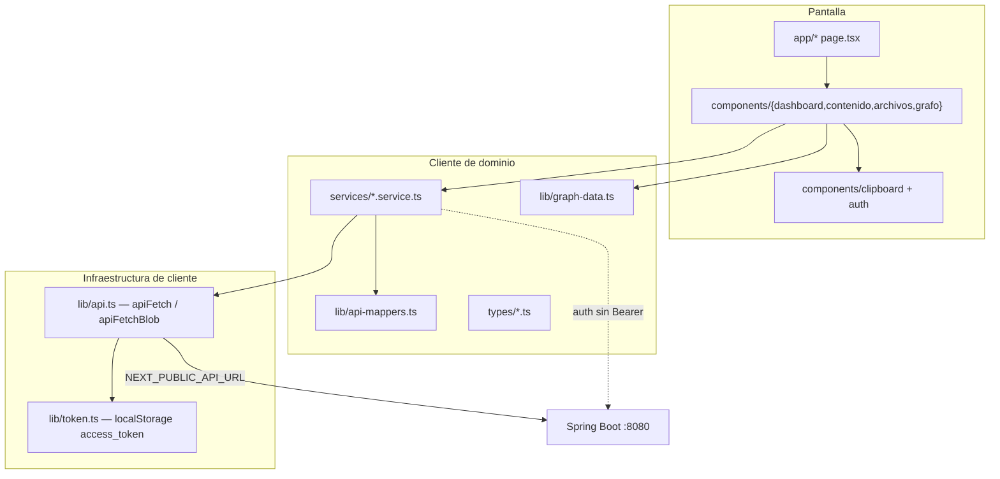
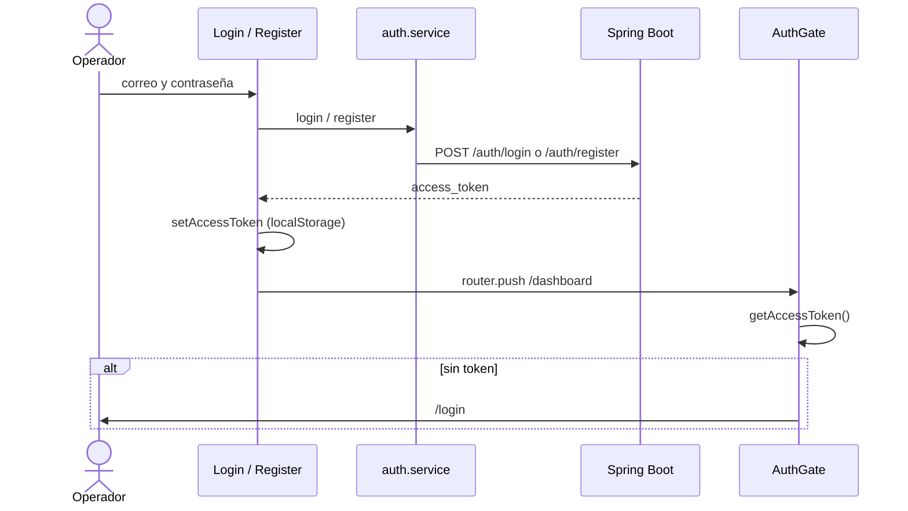

# Frontend TechISOlutions — arquitectura y capacidades

La aplicación web vive en `frontend/techisolutions/`. Es el cliente de **TechISOlutions**: consulta el corpus normativo ISO 45001 / SST, administra un índice privado por usuario y explora el grafo GraphRAG con evidencia documental.

Este documento describe qué ofrece el producto en pantalla y cómo está armado. El detalle de convenciones de código está en `frontend/AGENTS.md`. El arranque local está en `frontend/techisolutions/README.md`.

---

## 1. Qué ofrece

TechISOlutions no es un chatbot genérico. El operador trabaja sobre un **expediente normativo**: pregunta al corpus, ve de dónde sale cada afirmación y cruza eso con el mapa de categorías y temas.

| Capacidad | Dónde | Qué hace |
|---|---|---|
| Análisis GraphRAG | `/consultar` | Pregunta en lenguaje natural (≥ 20 caracteres). Recibe respuesta en Markdown, categoría, relevancia, palabras clave y **trazabilidad por sección** (corpus `BASE` o `PRIVADO`). |
| Historial de consultas | `/dashboard`, `/consultar?consulta={id}` | Reabre un análisis guardado. El panel muestra los más recientes y atajos a consultar o subir archivos. |
| Índice privado | `/archivos` | Sube PDF, TXT o MD (máx. 10 MB) con dominio `ISOS` o `LEYES`. Lista, filtra, descarga y elimina. Observa el estado del índice (`IDLE` → `FAILED`) y puede reintentar la reconstrucción. |
| Mapa de conocimiento | `/grafo` | Workspace de tres paneles (índice, plano force-graph, ficha). Ámbito **biblioteca general** o **mis documentos**. Historial de versiones del grafo BASE. |
| Búsqueda global | Header autenticado | Combobox sobre consultas (pregunta, fuente, palabra clave) y archivos. Abre `/consultar?consulta=` o `/archivos`. |
| Aislamiento de corpus | Consultas y grafo | Las fuentes marcan `BASE` o `PRIVADO`. Las privadas se descargan por el backend (`/api/archivos/{id}/descarga`), nunca con URLs de Object Storage. |
| Acceso | `/`, `/login`, `/register` | Landing pública con demo estática. Alta y sesión contra `POST /auth/register` y `POST /auth/login`. |

Lo que **no** hace el frontend: no habla con Data Science ni con OCI. Solo consume Spring Boot. Las rutas autenticadas no tienen modo mock.

---

## 2. Stack

| Pieza | Uso |
|---|---|
| Next.js 16 (App Router) | Rutas en `app/`, `output: "standalone"` para Docker |
| React 19 + TypeScript | Vistas cliente; páginas delgadas |
| Tailwind CSS 4 + shadcn | Tokens de papelería institucional |
| Bun | Install, scripts y runtime de la imagen |
| Vitest + Testing Library | Pruebas de servicios, mappers y vistas |
| react-force-graph-2d | Plano interactivo en `/grafo` |
| react-markdown + remark-gfm | Respuesta GraphRAG |

Fuentes: **Source Sans 3** (cuerpo y títulos) y **JetBrains Mono** (kickers, IDs, conteos). Paleta: papel `#f4f0e6`, tinta `#1a3a5c`, sello SST `#f0c419`, alerta `#c0392b`.

---

## 3. Mapa de rutas

```
Público                         Sesión (AuthGate)
────────                        ─────────────────
/           Landing ISO 45001   /dashboard    Panel operativo
/login      Acceso              /consultar    Chat GraphRAG + evidencia
/register   Alta                /archivos     Repositorio + índice
                                /grafo        Mesa de expediente
```

Navegación autenticada: **Panel · Consultar · Grafo · Archivos**. Cada vista monta `AuthGate` → `AppShell` (header, búsqueda global, nav).

`app/` solo compone. La lógica vive en componentes cliente (`*-view`, `*-panel`, `*-query`) y en `services/`.

---

## 4. Arquitectura de capas



Reglas de capa:

1. **`app/`** declara la ruta y pasa `searchParams`. No llama HTTP.
2. **`components/`** renderiza y orquesta estado de pantalla. `components/ui/` no hace fetch.
3. **`services/`** es el único lugar que conoce paths `/api/...` y `/auth/...`.
4. **`lib/api-mappers.ts`** acepta snake_case o camelCase del backend y entrega tipos de `types/`.
5. **`lib/api.ts`** adjunta Bearer, trata 401 (limpia token y manda a `/login`) y convierte el resto de errores en `ApiError`.
6. **`lib/token.ts`** es el único acceso a `localStorage` para la sesión.

El grafo GraphRAG llega como JSON conceptual (N1 categorías, N2 temas, N3 relaciones). `lib/graph-data.ts` lo normaliza (limpia Markdown, agrupa fuentes, recorta el plano a 24 temas) para el índice, el canvas y la ficha.

---

## 5. Flujos

### 5.1 Autenticación



Login y registro **no** usan `apiFetch`: van directo a `NEXT_PUBLIC_API_URL` para no disparar el redirect 401 antes de tener token. El resto de servicios sí llevan Bearer.

### 5.2 Consulta GraphRAG

1. El operador escribe una pregunta en `/consultar`.
2. `analizarConsulta` hace `POST /api/consultas` con `{ pregunta }`.
3. La vista muestra un hilo: pregunta del usuario + ficha GraphRAG (Markdown, categoría, relevancia, duración).
4. Cada fuente de `trazabilidad` indica corpus, ruta jerárquica, dominio y, si es `PRIVADO`, botón de descarga vía backend.
5. `/consultar?consulta={id}` rehidrata un análisis con `GET /api/consultas/{id}`.

### 5.3 Archivos e índice

1. Cola de hasta 5 cargas. Cada archivo exige dominio `ISOS` o `LEYES`.
2. `POST /api/archivos` es `multipart/form-data` (`file`, `dominio`).
3. El panel pagina (20 ítems), filtra por nombre y tipo, elimina y descarga.
4. `GET /api/indice` reporta el rebuild. Estados activos (`DIRTY`, `QUEUED`, `RUNNING`) se refrescan solos. `FAILED` ofrece `POST /api/indice/reintentar`.

### 5.4 Mesa de expediente (`/grafo`)

Tres superficies con el mismo peso:

| Panel | Rol |
|---|---|
| **Índice** | Lista accordion de categorías y temas, con búsqueda sobre título, documento o conexión. |
| **Plano** | Force-graph 2D sobre milimetrado de papel. Overview de categorías; al elegir una, sus temas (máx. 24 en canvas; la lista conserva todos). |
| **Ficha** | Carbónico amarillo: vacío, categoría (descripción, confianza, métricas) o tema (fuentes agrupadas por documento + triplets sujeto–relación–objeto). |

Ámbito:

- **Biblioteca general** → `GET /api/grafos/actual` + historial paginado y búsqueda por fecha.
- **Mis documentos** → `GET /api/grafos/privado` + estado del índice. Cuando el índice pasa a `SUCCEEDED`, recarga el grafo privado.

En móvil, un control Índice | Plano | Ficha; elegir un tema abre la ficha. Escape limpia el tema, no la categoría.

---

## 6. Contratos que consume

Base: `NEXT_PUBLIC_API_URL` (por defecto `http://localhost:8080`). En Docker esa URL debe ser alcanzable **desde el navegador**, no el hostname interno `backend`.

| Área | Métodos |
|---|---|
| Auth | `POST /auth/login`, `POST /auth/register` |
| Consultas | `POST /api/consultas`, `GET /api/consultas`, `GET /api/consultas/{id}`, `GET /api/consultas/buscar?q=` |
| Archivos | `GET /api/archivos`, `POST /api/archivos`, `GET /api/archivos/{id}`, `DELETE /api/archivos/{id}`, `GET /api/archivos/{id}/descarga` |
| Índice | `GET /api/indice`, `POST /api/indice/reintentar` |
| Categorías | `GET /api/categorias` |
| Grafos | `GET /api/grafos/actual`, `/privado`, `/id/{id}`, `/historial`, `/buscarfecha`, `POST /api/grafos/sincronizar` |

Tipos canónicos en `types/`. Los mappers toleran `json_data` / `jsonData`, `palabras_clave` / `palabrasClave`, etc.

Errores de UI:

- **400** — mensaje de validación en el formulario.
- **401** — sesión inválida; `apiFetch` limpia el token y recarga `/login`.
- **404** de grafo — estado vacío (“todavía no hay mapa publicado”).
- **5xx** — alerta con reintento, sin jerga de infraestructura.

---

## 7. Estructura de carpetas

```
frontend/techisolutions/
├── app/                 # Rutas App Router
├── components/
│   ├── auth/            # AuthGate, login, register, logout
│   ├── clipboard/       # Shell, nav, header, búsqueda, sellos, resultado GraphRAG
│   ├── contenido/       # Pantalla de consulta
│   ├── archivos/        # Repositorio
│   ├── dashboard/       # Panel
│   ├── grafo/           # Mesa de expediente
│   └── ui/              # Primitivos shadcn
├── services/            # HTTP
├── types/               # Contratos
├── lib/                 # api, mappers, token, graph-data, search
└── hooks/               # Reservado
```

Alias `@/` → raíz de `techisolutions/`.

---

## 8. Identidad visual

Metáfora: **clipboard / expediente SST**, no dashboard genérico.

- Papel, filetes navy, sello amarillo, tinta stamp-red para lo activo o el error.
- El grafo no es un radar oscuro: es un **plano técnico** clavado con clips; la ficha es papel carbónico.
- Copy de operador, sentence case: “Biblioteca general”, “Mis documentos”, “Selecciona una categoría o un tema”. Sin N1/N2/N3 ni `releaseId` en pantalla.

---

## 9. Calidad y operación

```bash
cd frontend/techisolutions
bun install
bun run dev          # :3000; con infra Docker usar :3002
bun run test
bun run lint
bun run typecheck
bun run build
```

Pruebas representativas: `grafo-view`, inspector e índice del mapa; `graph-rag-query` y resultado; servicios de consulta, archivo e índice; mappers.

Imagen: `Dockerfile` multi-stage (Bun → `standalone`). `NEXT_PUBLIC_*` se cuece en el **build**. Compose publica el frontend en `${FRONTEND_PORT:-3001}`.

---

## 10. Límites a tener en cuenta

- El token vive en `localStorage`. No hay refresh automático en el cliente: un 401 cierra la sesión.
- `AuthGate` hidrata como “sin sesión” y confirma el token en el cliente. La navegación típica es login → `router.push`; un F5 en una ruta protegida puede parpadear “Verificando sesión…”.
- El plano recorta temas a **24 nodos** por categoría (`N2_CAP`). El índice no recorta.
- Pregunta GraphRAG: mínimo **20** caracteres.
- Archivos: PDF / TXT / MD, **10 MB**, dominio obligatorio.
- El frontend no reconstruye el grafo: publica y observa lo que el backend y el pipeline ML ya materializaron.
